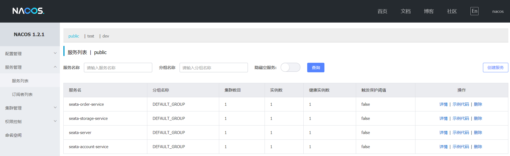

## Seata 分布式事务

Seata 是一款开源的分布式事务解决方案，致力于提供高性能和简单易用的分布式事务服务。Seata 将为用户提供了 AT、TCC、SAGA 和 XA 事务模式，为用户打造一站式的分布式解决方案。

- 官网地址：https://seata.io
- seata 类似于阿里云的GTS云组件

### 1. 模块分布

- seata-account-service2003 ——账户模块
- seata-order-service2001——订单模块
- seata-storage-service2002——库存模块

### 2. 启动流程

 

```
分布式事务
   下订单-->扣库存-->减账户（余额）———>修改订单状态
   
启动顺序（先启动nacos后启动seata-server）
 （1）nacos-server-1.2.1
 （2）seata-server-1.2.0
```

### 3. 运行结果

- 下单接口地址：http://localhost:2002/order/create

