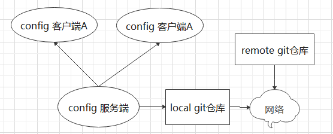

#### 数据控制总线中心

---

#### 一、开启应用设计模块:

- cloud-config-client1001
- cloud-config-server1000
- cloud-server-eureka7001
- springcloud-config 配置仓库

##### （1）[spring cloud config官网](https://cloud.spring.io/spring-cloud-config/reference/html/#_quick_start)     

```scss
客户端域名：127.0.0.1 config.server.wxw.com   # 1000
服务端域名：127.0.0.1 config.server.wxw.com   # 1000
```

- 原理图如下
- *

##### （2）实践测试服务端读取配置：

-  测试根路径的地址：http://config.server.wxw.com:1000/master/config-dev.yml

- 配置中心配置文件读取规则：

  ```scss
  ## 其中 label:代表分支、application:代表应用名称 、profile:代表：具体环境（test/prod/dev）
  /{application}/{profile}[/{label}]
  /{application}-{profile}.yml
  /{label}/{application}-{profile}.yml   # 建议使用
  /{application}-{profile}.properties
  /{label}/{application}-{profile}.properties
  ```

#####  （3）测试客户端读取服务端控制的配置信息

- 读取路径1：http://config.client.wxw.com:1001/configInfo    

##### （4）config的动态刷新之手动版

- 目的：避免你每次仓库更新了配置需要重启客户端服务

- 开启步骤：

  ```scss
  1. 开启健康监测，暴露监控端点
  2. 开启刷新功能：在Controller层添加注解：@RefreshScope
  3. 发送post请求更新 刷新客户端通知
         curl -X POST "http://localhost:1001/actuator/refresh"
  ```

- 测试步骤：

  ```scss
  1. 修改仓库配置文件
  2. 服务端请求配置文件 http://config.server.wxw.com:1000/master/config-dev.yml
  3. 使用curl命令向客户端发送post请求，刷新监控配置  curl -X POST "http://localhost:1001/actuator/refresh"
  4. 客户端请求获取服务端配置信息【已更新】：http://config.client.wxw.com:1001/configInfo
  ```

##### （5）[Curl使用手册](https://curl.haxx.se/docs/manual.html)      

##### （6）缺点问题总结

- 多个微服务客户端如何处理
- 每个微服务客户端都要执行一次 post请求？---for循环好么
- 可否广播，一次通知，处处生效？
- 如果想大范围的自动刷新，或精确更新还有什么方法

#### 二、bus 总线是直接在config基础上的拓展      

- http://localhost:1002/configinfo
- http://localhost:1001/configInfo
- http://localhost:1000/master/config-dev.yml

> Bus是一处修改，处处生效 （支持 kafka和rubbitMQ）

1. 发送post给客户端，链式生效（不满足单一职责原则）
2. 发送给服务总线，处处生效（推荐）

- 修改github 配置版本号
- 给服务端发送post请求，会处处生效

```scss
 curl -X POST "http://localhost:1000/actuator/bus-refresh"
```

##### （1） bus顶点通知


