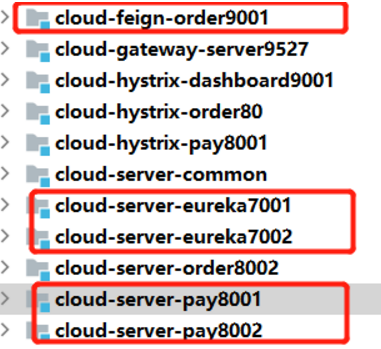

### Spring Cloud OpenFeign

#### 案例组合模块简介

 

- 注册中心服务——节点1：cloud-server-eureka7001   
- 注册中心服务——节点2：cloud-server-eureka7002
  - 访问地址：http://127.0.0.1:7001/ 
- 注册提供服务——节点1：cloud-server-pay8001    provider 
- 注册提供服务——节点2：cloud-server-pay8002    provider   
- 拉取消费服务：cloud-feign-order9001    consumer  
  -  http://localhost:9001/consumer/payment  （调用普通的RPC 调用测试）
  -  http://localhost:9001/consumer/payment/get/5 （负载均衡测试）
  -  http://localhost:9001/consumer/payment/histrix-fallback  (熔断降级测试)
  -  http://localhost:9001/consumer/payment/feign/timeout  (超时测试)

